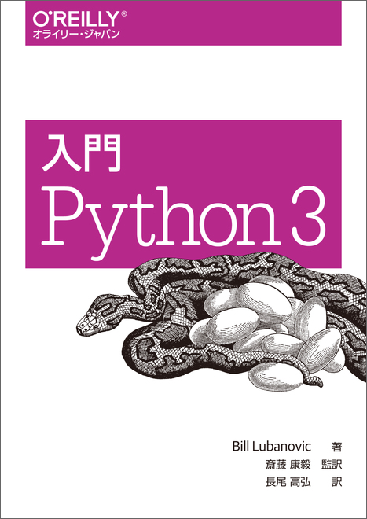

# Python_practice
This is practice of Python!

This code is my solution of practice in [入門python3](https://www.oreilly.co.jp/books/9784873117386/).

<ol>
  <li>Chapter1: What is **Python** (There is no practice in this project)</li>
  <li>Chapter2: Number, String, Variables</li>
  <li>Chapter3: List, Tuple, Dict, Set</li>
  <li>Chapter4: The structure of code</li>
  <li>Chapter5: Module, Package, Program</li>
  <li>Chapter6: Object, Class</li>
  <li>Chapter7: Text data and binary data</li>
  <li>Chapter8: Destination of data</li>
  <li>Chapter9: Structure of Web</li>
  ...
</ol>
